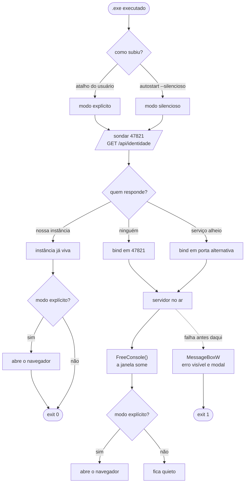

# DESIGN: Ciclo de vida do app

> Como dar ao app um começo, um meio e um fim explícitos: link estável, instância única, sem
> console visível e com encerramento pela UI.

## Metadados

| Atributo | Valor |
|----------|-------|
| **Feature** | CICLO_DE_VIDA |
| **Data** | 2026-07-21 |
| **DEFINE** | [DEFINE_CICLO_DE_VIDA.md](./DEFINE_CICLO_DE_VIDA.md) |
| **Status** | Pronto para Build |

---

## A decisão central: o token sai da URL

O DEFINE deixou em aberto (pergunta 4) como ter link estável **sem** perder a proteção de CSRF
local — o AT-109. A resposta é mais simples do que o próprio DEFINE supôs, e não envolve persistir
nada:

**O token não precisa ser estável. O que precisa ser estável é o endereço.**

Hoje o token viaja na URL (`http.ts:72`), então o endereço herda a validade do token. Se a página
**buscar** o token depois de carregar, o endereço volta a ser só `http://127.0.0.1:47821/` — e o
token pode continuar rotacionando a cada execução, que é a postura mais segura.

```
hoje:   favorito = http://127.0.0.1:47821/?t=<token-da-execucao-1>
        execução 2 gera outro token → favorito morto  ❌

design: favorito = http://127.0.0.1:47821/
        a página carrega → busca o token atual → funciona sempre  ✅
```

### Por que isso não abre um buraco de CSRF

O ataque que o token barra é uma **página de outra origem** disparando `POST /api/baixar` no app.
Com o token fora da URL, a defesa passa a se apoiar em três camadas independentes — verificadas,
não supostas:

| Camada | Por que barra o atacante | Estado |
|--------|--------------------------|--------|
| **Resposta não-legível cross-origin** | `GET /api/sessao` devolve o token, mas o servidor **não emite `Access-Control-Allow-Origin`** — o navegador entrega a resposta ao nosso JS e recusa entregá-la ao de terceiro | ✅ verificado em 2026-07-21: `/` e `/api/estado` responderam com o header **ausente** |
| **Header customizado exige preflight** | Chamar a API exige `x-token`. Header customizado cross-origin dispara `OPTIONS` de preflight, que não respondemos — o navegador nem envia o pedido real | ✅ já é o contrato de `http.ts:148` |
| **`Sec-Fetch-Site`** | Navegador informa a procedência do pedido, e JS **não pode forjá-lo** (é forbidden header name). `cross-site` em rota de API → 403 | ➕ camada nova deste design |
| **`X-Frame-Options: DENY`** | Impede embutir a UI num iframe para ler o token de dentro | ✅ já entregue |

O `?t=` na querystring (`http.ts:150`) **é removido**: com o token vindo do header, aceitar também
pela URL só reabre o vetor que estamos fechando — e é o caminho pelo qual o token vazaria em
histórico e `Referer`.

### O que isso resolve de brinde

- O token some do **histórico do navegador** e de qualquer captura de tela
- A classe inteira de bug "aba com token expirado" deixa de existir no caminho feliz
- O `Referrer-Policy: no-referrer` entregue em `9cf372d` continua correto, mas deixa de ser a única
  coisa entre o token e um terceiro

## Visão de arquitetura



```text
┌─────────────────────────────────────────────────────────────────┐
│  navegador                     app (1 processo, porta 47821)     │
│                                                                  │
│  favorito ──GET /──────────────► serve a UI  (sem token)         │
│  UI ────────GET /api/sessao ───► { token }   (same-origin)       │
│  UI ────────POST /api/* ───────► x-token + Sec-Fetch-Site        │
│  UI ────────POST /api/encerrar ► desliga tudo e sai              │
│                                                                  │
│  página hostil ──GET /api/sessao──► responde, mas o BROWSER      │
│                                     recusa entregar (sem CORS)   │
└─────────────────────────────────────────────────────────────────┘
```

## Componentes

| Componente | Responsabilidade | Tecnologia |
|------------|------------------|------------|
| `src/lifecycle/instancia.ts` | Sondar `47821`, identificar se quem responde é nosso, decidir subir × ceder | `fetch` com timeout curto |
| `src/lifecycle/console.ts` | `FreeConsole()` após arranque bem-sucedido; `MessageBoxW()` para falha de arranque | `bun:ffi` → `kernel32` / `user32` |
| `src/lifecycle/autostart.ts` | Ler, ligar e desligar o autostart do usuário | `reg.exe` (HKCU), `spawn` com `shell: false` |
| `src/server/http.ts` (alterado) | Rotas novas: `/api/identidade`, `/api/sessao`, `/api/encerrar`, `/api/autostart` | Node `http` |
| `src/server/guards.ts` (alterado) | `procedenciaEhPermitida()` — avalia `Sec-Fetch-Site` | função pura |
| `src/ui/app.js` (alterado) | Buscar o token ao carregar; botão Encerrar; alternador de autostart | JS sem framework |
| `src/main.ts` (alterado) | Orquestra: modo → sonda → servidor → console → navegador | — |

### Por que `bun:ffi` e não o flag do Bun

O DEFINE já registra a constraint: `--windows-hide-console` **não funciona** (verificado em
Bun 1.3.14, com e sem `--target`; bug aberto [#19916](https://github.com/oven-sh/bun/issues/19916)).
`FreeConsole()` em runtime foi verificado funcionando — e, por ser runtime, **não** restringe o
cross-compile Linux→Windows que a futura CI de release vai precisar.

## Data Flow

### Cenário 1 — primeira execução (atalho, nada rodando)

1. `main.ts` detecta **modo explícito** (sem `--silencioso` no `argv`)
2. `instancia.ts` sonda `GET http://127.0.0.1:47821/api/identidade`, timeout **300 ms** → sem resposta
3. Servidor sobe em `47821`; bootstrap de `yt-dlp`/`ffmpeg` roda em paralelo (inalterado)
4. `console.ts` chama `FreeConsole()` — a janela some
5. Navegador abre em `http://127.0.0.1:47821/` — **sem token na URL**
6. A UI carrega, chama `GET /api/sessao`, guarda o token em memória e habilita o fluxo

### Cenário 2 — link salvo (o fluxo-alvo, AT-100)

1. O app já está no ar (por atalho ou autostart)
2. A pessoa abre o favorito `http://127.0.0.1:47821/`
3. `GET /` serve a UI sem exigir token (inalterado)
4. A UI busca o token da execução **atual** e opera normalmente — nenhum passo extra, nenhuma
   mensagem de expiração

### Cenário 3 — execução duplicada (AT-101)

1. `instancia.ts` sonda e recebe o marcador de identidade próprio
2. **Modo silencioso** → encerra com `exit 0`, sem abrir nada
3. **Modo explícito** → abre o navegador na instância viva e encerra com `exit 0` — ver o desvio
   registrado abaixo

### Cenário 4 — porta ocupada por terceiro (AT-103, A-105)

1. A sonda recebe resposta, mas **sem** o marcador → não é nosso app
2. Sobe em porta alternativa (preserva o fallback de `http.ts:91`)
3. A UI exibe aviso persistente: *"o endereço de sempre estava ocupado; este link vale só para esta
   sessão"* — a pessoa entende por que o favorito não serviu, em vez de achar que quebrou

## Integration Points

| Rota | Método | Token? | Contrato |
|------|--------|--------|----------|
| `/api/identidade` | GET | **não** | `{ app: 'youtube-downloader', pid: number }` — marcador para a sonda de instância. Não expõe nada sensível: quem já está na máquina pode ver o processo de qualquer forma |
| `/api/sessao` | GET | **não** | `{ token: string }` — protegido por não ser legível cross-origin, não por credencial |
| `/api/encerrar` | POST | sim | `202` e então desliga: aborta downloads, mata filhos (reusa `encerrarTodosOsProcessos`), fecha o servidor, `process.exit(0)` |
| `/api/autostart` | GET / POST | sim | `{ ligado: boolean }` — POST alterna e devolve o estado real relido do registro, não o presumido |

Chave do autostart: `HKCU\Software\Microsoft\Windows\CurrentVersion\Run`, valor
`youtube-downloader` → `"<caminho>\youtube-downloader.exe" --silencioso`. **HKCU**, portanto sem
privilégio de administrador; desligar remove o valor (AT-110).

## Testing Strategy

| AT do DEFINE | Como se prova | Camada |
|--------------|---------------|--------|
| AT-100 link salvo funciona | Sobe servidor, pega token via `/api/sessao`, **fecha**, sobe de novo, e o mesmo caminho `/` volta a servir uma UI operante | integração |
| AT-101 2ª execução silenciosa | Duas chamadas de `decidirArranque()` com a mesma porta: a 2ª devolve `ceder` | unit + integração |
| AT-101b / AT-101c abre aba | `decidirAbertura(modo, jaRodava)` — tabela-verdade dos 4 casos | unit |
| AT-102 instância morta | Sonda contra porta sem ninguém → `subir`, sem bloqueio | integração |
| AT-103 serviço alheio | Servidor de teste responde `200` em `/api/identidade` **sem** o marcador → decisão é `porta alternativa`, nunca `ceder` | integração |
| AT-104 encerrar | `POST /api/encerrar` → `202`, e a porta aceita bind em < 2 s | integração |
| AT-105 encerrar durante download | Download simulado em curso + encerrar → `AbortSignal` disparado, registro de processos vazio | integração |
| AT-106 console some | `GetConsoleWindow()` não-nulo antes e nulo depois de `esconderConsole()` | unit (FFI real) |
| AT-107 falha visível | `MessageBoxW` é chamado antes do `exit(1)` — verificado por injeção da dependência de UI nativa (sem abrir caixa de verdade no CI) | unit |
| AT-108 sessão inválida ainda explica | Os 4 testes de `ui-bootstrap.test.ts` **continuam passando** — a rede de segurança não pode sumir junto com a causa | unit (jsdom) |
| AT-109 CSRF barrado | `Sec-Fetch-Site: cross-site` → 403; ausência de `Access-Control-Allow-Origin` em toda resposta; `?t=` **não** autentica mais | integração |
| AT-110 autostart reversível | Ligar → valor existe; desligar → valor some. Contra uma raiz de registro de teste, não a real | unit + integração |

**Verificação por mutação** para AT-109 e AT-101, seguindo o que já se firmou neste projeto: remover
cada guarda tem de matar um teste nomeado. Guarda sem teste que morra é guarda que some no próximo
refactor — foi assim que os headers de segurança ficaram descobertos até a auditoria.

## Error Handling

| Falha | Tratamento |
|-------|------------|
| **Arranque falha antes do servidor** | `MessageBoxW` modal com texto legível, **antes** do `exit(1)`. O `console.error` de `main.ts:225` é insuficiente: com o console liberado a mensagem sumiria, e mesmo sem liberar a janela fecha junto com o processo — o usuário veria um piscar |
| Porta `47821` ocupada por terceiro | Porta alternativa + aviso persistente na UI (Cenário 4) |
| Sonda de identidade expira | Trata como "ninguém lá" e sobe. Falso negativo custa uma instância a mais; falso positivo custaria **não subir** — o erro escolhido é o barato |
| `FreeConsole` falha | Segue com o console visível. É SHOULD, não MUST: não pode derrubar o app |
| `reg.exe` falha ao alternar autostart | A UI relê o estado real e mostra o que de fato ficou — nunca confirma o que não conseguiu fazer |
| Encerrar com download em curso | A UI confirma antes; confirmado, aborta e encerra (AT-105) |

## Security

- **AT-109 é o requisito inegociável** e está coberto por 3 camadas independentes (tabela do topo).
  Nenhuma delas sozinha é a defesa — o `Sec-Fetch-Site` entra justamente para que a ausência de CORS
  não seja ponto único
- **`?t=` deixa de autenticar.** Reduz superfície e tira o token do histórico
- **`/api/identidade` é anônima de propósito** e expõe só `app` + `pid`. Quem consegue falar com
  `127.0.0.1` já enumera processos locais; esconder isso seria teatro
- **`/api/encerrar` exige token** — sem isso qualquer página seria capaz de derrubar o app (DoS local)
- **Autostart só em HKCU**, sem elevação, e reversível pela UI. Escrever em HKLM seria pedir
  administrador para um app de usuário
- Preserva integralmente o que já existe: allowlist de `Host` (DNS rebinding), `timingSafeEqual`,
  CSP, `X-Frame-Options`, `nosniff`, `Referrer-Policy`, `spawn` com `shell: false`

## Observability

Log local em arquivo (`registrar()` de `main.ts`, inalterado — nunca telemetria remota). Eventos
novos: `arranque modo=<explicito|silencioso> decisao=<subir|ceder|porta-alternativa>`,
`console liberado`, `encerrado por=<ui|sinal>`, `autostart <ligado|desligado>`.

O log ganha importância neste ciclo: com o console escondido, ele passa a ser o **único** rastro de
diagnóstico. Por isso a decisão de arranque é registrada sempre — inclusive quando o processo cede e
sai, que é o caso em que não sobra nenhuma outra evidência.

## Conhecimento da KB consultado

O DEFINE não declara domínios de KB (seção *Contexto técnico*: `—`). O inventário real da KB tem
**4 entradas, todas em `tools/media`** — `selecao-de-formato`, `saida-programatica`,
`taxonomia-de-erros`, `autoatualizacao-do-binario`. Nenhuma toca ciclo de vida de processo, HTTP ou
empacotamento.

> _Design não ancorado em conhecimento curado: a KB deste projeto cobre só o domínio `media`, que é
> ortogonal a esta feature. Não é degradação — é ausência legítima._

O que **de fato** ancorou este design são as ADRs e o código: [`0002-empacotamento.md`](../../../docs/adr/0002-empacotamento.md)
(Bun `--compile`), `src/server/guards.ts` (defesas existentes) e as constraints verificadas no DEFINE.

## Localização e infra

- **Código novo:** `src/lifecycle/{instancia,console,autostart}.ts`
- **Alterados:** `src/main.ts`, `src/server/http.ts`, `src/server/guards.ts`, `src/ui/app.js`,
  `src/ui/index.html`, `src/ui/app.css`
- **Testes:** `tests/unit/lifecycle-*.test.ts`, `tests/unit/ui-sessao.test.ts`,
  `tests/integration/server.test.ts` (estendido)
- **Infra/IaC:** nenhuma. Não toca CI nem release. `scripts/build.mjs` fica **inalterado** — a
  decisão de usar `FreeConsole` em runtime em vez do flag de compilação é justamente o que evita
  mexer no empacotamento

---

## ⚠ Desvio consciente do AT-101

O DEFINE diz que a 2ª execução encerra **em silêncio, sem abrir aba**. Seguir isso ao pé da letra
produz um resultado ruim no caso mais comum:

> A pessoa clica no atalho. O app já está rodando (autostart, ou ela esqueceu que abriu).
> **Nada acontece.** Ela clica de novo. Nada acontece.

O que você pediu foi que nada aparecesse **sem ser pedido**. Clicar no atalho *é* pedir. Por isso o
design distingue a **procedência** do processo, e não apenas a existência de outra instância:

| Como subiu | Já havia instância? | Abre aba? |
|------------|---------------------|-----------|
| Atalho (explícito) | não | **sim** |
| Atalho (explícito) | sim | **sim** ← desvio do AT-101 |
| Autostart (`--silencioso`) | não | não |
| Autostart (`--silencioso`) | sim | não |

A promessa "1 servidor sempre" é mantida em todos os casos. O que muda é só quando uma aba aparece.
**Se você discordar, o ajuste é de uma linha** (`decidirAbertura`) e o AT-101 volta ao literal — mas
prefiro registrar o desvio a implementar em silêncio algo que contraria o artefato anterior.

---

**Próximo passo:** `/build .claude/sdd/features/DESIGN_CICLO_DE_VIDA.md`
