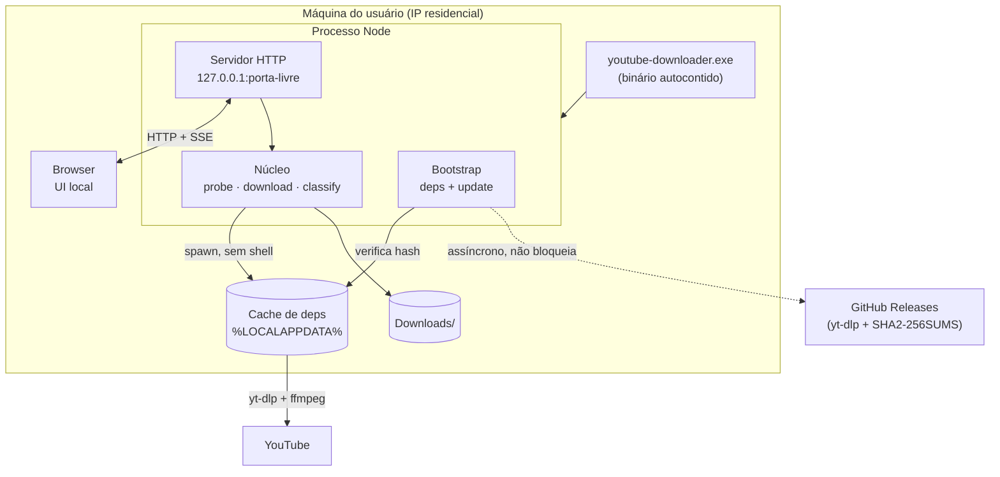

# DESIGN: Downloader local com Web UI

> Design técnico para implementar o executável Windows que sobe uma Web UI local e baixa vídeo
> ou áudio do YouTube pela conexão do próprio usuário.

## Metadados

| Atributo | Valor |
|----------|-------|
| **Feature** | DOWNLOADER_LOCAL |
| **Data** | 2026-07-20 |
| **DEFINE** | [DEFINE_DOWNLOADER_LOCAL.md](./DEFINE_DOWNLOADER_LOCAL.md) (Clarity 13/15) |
| **Status** | Pronto para Build |

---

## Visão de arquitetura

Um processo Node/TypeScript é o **pai**: serve a UI, orquestra os binários externos e traduz
tudo que eles emitem para uma linguagem que a UI entende. Nada sai da máquina do usuário exceto
as requisições ao YouTube feitas pelo `yt-dlp`.



```text
┌──────────────────────────────────────────────────────────────────┐
│ .exe                                                             │
│  ├─ Bootstrap ──► cache de deps (yt-dlp, ffmpeg) ── hash check   │
│  │      └─ update do yt-dlp roda EM PARALELO (nunca bloqueia)    │
│  ├─ Servidor 127.0.0.1:<porta livre> ──HTTP+SSE──► Browser (UI)  │
│  └─ Núcleo                                                        │
│        1. valida URL         (local, sem subprocesso)   AT-005    │
│        2. probe `-J`         (simula, não baixa)        AT-012    │
│        3. download           (progresso via template)   AT-001/2  │
│        4. classifica erro    (exit code → stderr → fallback)      │
└──────────────────────────────────────────────────────────────────┘
```

## Componentes

| Componente | Responsabilidade | Tecnologia |
|------------|------------------|------------|
| `bootstrap` | Garantir `yt-dlp` + `ffmpeg`/`ffprobe` no cache, verificar hash, disparar update assíncrono | Node, `fetch`, `crypto` |
| `server` | Servir a UI estática, expor a API local, emitir progresso por SSE | `node:http` (sem framework) |
| `probe` | Chamar `yt-dlp -J` e devolver metadados + catálogo de formats normalizado | `child_process.spawn` |
| `downloader` | Montar o seletor, spawnar o download, traduzir progresso e caminho final | `child_process.spawn` |
| `errors` | Classificar falha em 3 camadas e produzir mensagem pt-BR | TypeScript puro |
| `ui` | Formulário, painel avançado, barra de progresso, estados de erro | HTML/CSS/TS vanilla |
| `landing` | Página estática de instruções publicada no Pages (só quando o repo abrir) | HTML/CSS estático |

**Sem framework de UI, por YAGNI.** A interface é um campo de URL, dois botões, um painel
recolhido e uma barra de progresso. React/Vue custariam build, dependências e peso no binário sem
resolver nada que o DOM nativo não resolva. A landing reaproveita o mesmo CSS.

## Data Flow

O fluxo obedece à estratégia de 3 camadas de defesa da KB (`taxonomia-de-erros`): **falhar o
mais cedo e mais barato possível**.

1. **Arranque.** O `.exe` sobe o servidor em `127.0.0.1` numa **porta livre** (AT-009), abre o
   browser e — **em paralelo, sem bloquear** — verifica/atualiza as dependências. A UI aparece
   antes do update terminar (SC-1 × SC-7); o botão de download fica desabilitado com aviso de
   preparo enquanto o cache não estiver pronto (AT-003).
2. **Camada 1 — validação local.** A URL é validada no Node (host, presença de video id) **antes
   de qualquer `spawn`** — o AT-005 exige que nenhum processo seja disparado. Distingue "não é
   URL" de "é URL, mas não do YouTube".
3. **Camada 2 — sonda `-J`.** `yt-dlp -J` **simula por default**: valida a URL de verdade, traz
   título/duração/thumbnail e o array `formats`, tudo sem baixar um byte (AT-012). Aqui aparecem
   AT-006 (indisponível), AT-007 (sem rede) e AT-008 (anti-bot). A sonda roda com `--retries 1` e
   timeout curto no Node — ela deve falhar **rápido**; a persistência é para o download real.
4. **Montagem do seletor.** O painel avançado é preenchido com as resoluções que **aquele vídeo
   realmente tem**, extraídas do `formats` — não um menu fixo 1080p/720p/480p que pode não
   corresponder à realidade.
5. **Download.** `spawn` sem shell, com progresso em JSON por linha nos dois canais
   (`download:` e `postprocess:`). O caminho final vem de `--print after_move:filepath`.
6. **Camada 3 — classificação do erro real.** Exit code decide *se* falhou; stderr tenta decidir
   *o quê*; fallback genérico cobre o resto (AT-013).

### Contrato de invocação do `yt-dlp`

Flags fixas em toda invocação, com a razão de cada uma:

| Flag | Por quê |
|------|---------|
| `--ignore-config` | Impede que um `yt-dlp.conf` na máquina do usuário altere o app (bug irreprodutível) |
| `--no-playlist` | URL do YouTube frequentemente carrega `&list=`; playlist está fora de escopo |
| `--newline` | Sem isso o progresso reescreve a linha com `\r` e o leitor no Node nunca vê `\n` |
| `--ffmpeg-location <cache>` | Nunca depender do `PATH` do usuário |
| `--progress-template download:…` e `postprocess:…` | **Dois canais**: sem o segundo, a conversão MP3 fica muda e a barra congela em 100% |
| `--print after_move:filepath` | Único jeito estável de saber onde o arquivo acabou (`.part` e merge produzem nomes intermediários) |
| `-o <template do app>` | Nome de saída controlado pelo app |

**Proibido:** `-i`/`--ignore-errors` — a doc diz que o download é considerado bem-sucedido *mesmo
se o pós-processamento falhar*, o que faria o AT-002 anunciar sucesso sem MP3 em disco.

### Seletores

| Caso | Seletor | Razão |
|------|---------|-------|
| Vídeo (padrão) | `-f "bv*[vcodec~='^((he|a)vc\|h26[45])']+ba/bv*+ba/b"` + `--merge-output-format mp4` + `--remux-video mp4` | Filtrar H.264 **na origem** é mais seguro que remuxar VP9/AV1 e gerar arquivo que o player do Windows não toca. O `/b` final impede falha em vídeo só-progressivo. O `--remux-video` garante o container MP4 do AT-001, já que `--merge-output-format` é **ignorado quando não há merge** |
| Vídeo com resolução escolhida | `-S "res:<altura>"` | **`-S`, não `-f`**: o usuário expressa preferência, não contrato. `-S` degrada sozinho para a melhor disponível (AT-004 revisado); `-f [height<=N]` falharia se o vídeo não tiver aquela altura. `res:` em vez de `height:` porque ordena pela menor dimensão e trata vídeo vertical (Shorts) corretamente |
| Áudio | `-x --audio-format mp3` | `--audio-format best` (default) **não converte** — não entrega `.mp3`. O encode com libmp3lame é inevitável para o AT-002 |

## Integration Points

| Ponto | Contrato | Notas |
|-------|----------|-------|
| `yt-dlp` (subprocesso) | Entrada: argv (nunca shell). Saída: stdout JSON/templates, stderr texto, exit code | `≠ 0` é o sinal binário de falha; a categoria vem do stderr, best effort |
| `ffmpeg`/`ffprobe` (subprocesso do yt-dlp) | Invocado indiretamente via `--ffmpeg-location` | `-x` exige **ambos** — `ffprobe` é binário separado |
| GitHub Releases | HTTPS: binário + `SHA2-256SUMS` | Bootstrap e update; verificação de hash obrigatória |
| Browser ↔ servidor | HTTP local + SSE para progresso | Ver *Security* — não é um endpoint inocente |

**SSE, não WebSocket:** o progresso é unidirecional (servidor → UI) e SSE é nativo, reconecta
sozinho e não exige biblioteca. WebSocket seria capacidade não usada.

## Testing Strategy

| AT | Como é provado | Tipo |
|----|----------------|------|
| AT-001 vídeo MP4 | Download real de vídeo curto conhecido; asserção de container via `ffprobe` — **não** pela extensão do arquivo | Integração (rede) |
| AT-002 áudio MP3 | Idem, asserção de codec MP3 + presença de metadados | Integração (rede) |
| AT-003 1ª execução | Cache apontado para diretório temporário vazio; verifica bootstrap completo sem input | Integração |
| AT-004 resolução | `-S res:720` em vídeo **sem** 720p; asserção de que degradou e informou, sem falhar | Integração (rede) |
| AT-005 URL inválida | Tabela de entradas inválidas; asserção de que **nenhum `spawn` ocorreu** (spy no spawn) | Unit |
| AT-006/007/008 | **Fixtures de stderr real** capturadas de execuções verdadeiras → classificador | Unit |
| AT-009 porta ocupada | Ocupa a porta default e sobe o app; asserção de que escolheu outra | Integração |
| AT-010 update | Cache com binário antigo; asserção de que atualizou sem bloquear | Integração |
| AT-011 encerramento | Fecha o app; asserção de que nenhum processo filho sobreviveu | Integração |
| AT-012 sonda | Spy: asserção de que `-J` precede qualquer download e que `--no-simulate` **nunca** é passado | Unit |
| AT-013 falha desconhecida | stderr sintético que não casa com padrão nenhum; asserção de mensagem genérica + log do bruto | Unit |
| SC-1/2/3 | Medição cronometrada, reportada no BUILD_REPORT | Benchmark |
| SC-6 | Tamanho do `.exe` no CI, com **falha do build** se exceder 120 MB | Gate de CI |

**O classificador de erro é testado por fixture, não por mock.** A KB registra que as strings
exatas do extrator não foram confirmadas na doc — capturar stderr real e versioná-lo como fixture
é o que torna a regressão detectável quando o yt-dlp mudar.

**Testes de rede são marcados e separados.** Dependem do YouTube e podem falhar por AT-008; não
podem bloquear o loop de desenvolvimento nem o CI de PR.

## Error Handling

Implementa a estratégia em camadas da KB. Princípio: **exit code decide se falhou; stderr tenta
dizer o quê; o fallback cobre o resto.**

| Camada | Onde | Cobre |
|--------|------|-------|
| 1 — pré-voo local | Node, antes do `spawn` | URL inválida, deps ausentes |
| 2 — sonda `-J` | Subprocesso que simula | Indisponível, sem rede, anti-bot |
| 3 — classificação | stderr do download | O que escapou |

Refinamentos que vieram da KB e que um design ingênuo erraria:

- **Preferir campo estruturado a grep.** Quando o `-J` funciona, `availability`
  (`private`/`unlisted`/`subscriber_only`) e `live_status` classificam sem parse de texto. Só
  caia no stderr quando o `-J` falhou inteiro.
- **`"This content isn't available, try again later"` é rate limit (AT-008), não vídeo
  indisponível (AT-006).** O texto engana; classificá-lo errado faria o usuário concluir que o
  vídeo sumiu quando bastava esperar.
- **`total_bytes` é `None` no caso comum** (DASH), não na borda. Barra que divide por ele produz
  `NaN%`; usar `total_bytes_estimate` e, com fragmentos, `fragment_index`/`fragment_count`.
- **Ignorar `status` desconhecido** em vez de tratá-lo como erro — é o contrato de
  compatibilidade adiante quando o yt-dlp se atualizar.
- **Fallback genérico obrigatório (SC-5/AT-013):** mensagem compreensível + detalhe técnico atrás
  de "ver detalhes" + stderr bruto no log local. Nunca na UI.

## Security

Um servidor HTTP em `localhost` **não é um endpoint inocente** — qualquer página aberta no
browser do usuário pode tentar falar com ele.

| Risco | Mitigação |
|-------|-----------|
| Página maliciosa dispara downloads no app (CSRF local) | Bind exclusivo em `127.0.0.1` (nunca `0.0.0.0`), **token de sessão** aleatório gerado no arranque e exigido em toda chamada da API; a URL aberta no browser já o carrega |
| DNS rebinding | Validar o header `Host` contra `127.0.0.1:<porta>` e rejeitar o resto |
| Injeção de comando via título/URL do vídeo | `spawn` com **array de argumentos**, nunca `shell: true`. Título de vídeo com aspas ou `&` é entrada hostil por construção. Pelo mesmo motivo, `--exec` é rejeitado no design: acrescenta quoting de shell sem ganho sobre `--print` |
| Path traversal no destino | Resolver e confinar o caminho de saída; template `-o` controlado pelo app, nunca pelo input |
| Binário adulterado no bootstrap | Verificar SHA256 de tudo que o bootstrap baixa. **Preservar o nome original do `yt-dlp.exe`** no cache: o checksum é buscado por **sufixo do nome** no `SHA2-256SUMS`, e renomear faz a verificação ser **pulada em silêncio** (A-008) |
| Config do usuário alterando comportamento | `--ignore-config` em toda invocação |

**Fora de escopo por decisão, não por esquecimento:** proxy, cookies de conta de terceiro e spoof
de cliente para contornar AT-008.

## Observability

Sem telemetria remota — o app é local e não manda nada para lugar nenhum.

- **Log em arquivo** no diretório de dados do app, com rotação simples: comando invocado (argv),
  exit code, stderr bruto, tempos de cada fase. É o que torna AT-013 diagnosticável.
- **Nunca logar o JSON do `-J` inteiro** — dezenas de formats, centenas de KB por vídeo.
- **Na UI**, só a mensagem tratada, com o detalhe técnico disponível sob demanda.
- **Marcos cronometrados** (arranque, bootstrap, download) medidos e reportados no BUILD_REPORT
  para confrontar SC-1/SC-2/SC-3, que hoje são metas não medidas (A-003).

## Conhecimento da KB consultado

| Entrada (`id`) | Camada | Por que ancora este design |
|----------------|--------|----------------------------|
| `saida-programatica` | tools | Define o contrato de invocação inteiro: canais estáveis (`-J`, `--print`, `--progress-template`), `after_move:filepath` para o caminho final, `--newline`, `spawn` sem shell, e a proibição de parsear stdout humano |
| `selecao-de-formato` | tools | Decide os seletores: `bv*+ba/b` com `/b` obrigatório, `-S res:` em vez de `-f [height<=]` no painel avançado, filtro H.264 na origem, `--remux-video` para garantir MP4 quando não há merge |
| `taxonomia-de-erros` | tools | Origem da arquitetura de 3 camadas, do `-J` como sonda barata, da proibição de `-i`, do fallback genérico e da distinção rate-limit × indisponível |
| `autoatualizacao-do-binario` | tools | Delegar update ao `-U`/`--update-to` (checksum + troca atômica), separar ciclo de vida do ffmpeg, preservar o nome do binário no cache |

## Localização e infra

- **Onde o código mora:**
  ```text
  src/
    main.ts            entrada: bootstrap → servidor → abre browser
    bootstrap/         cache de deps, verificação de hash, update assíncrono
    server/            http + SSE + token de sessão
    ytdlp/             probe, downloader, seletores, parsing de progresso
    errors/            classificador em 3 camadas + mensagens pt-BR
    ui/                html/css/ts estáticos servidos pelo servidor
  site/                landing do GitHub Pages (publica só com repo público)
  tests/
    unit/              validação, classificador, seletores, parsing
    integration/       marcados; alguns exigem rede
    fixtures/          stderr real capturado, JSON de -J reduzido
  ```
- **Empacotamento:** **`bun build --compile`** como escolha primária — compila TypeScript direto,
  sem pipeline de bundle separado, e cross-compila. **Node SEA é o plano B**, estável desde o
  Node 22. A escolha **não está fechada por preferência**: o BUILD deve medir os dois `.exe` e o
  CI falha se exceder 120 MB (SC-6). A baseline de ~50 MB do runtime é chão, não teto (A-002).
- **Mudanças de infra/IaC:**
  - Workflow de build/release no Actions, em runner Windows, **disparado por tag** — não a cada
    push, porque repositório privado consome cota e runner Windows conta 2×.
  - Release publica o `.exe` + o SHA256 do artefato.
  - GitHub Pages fica **inativo** enquanto o repositório for privado (plano Free exige repo
    público); a landing é construída mas só vai ao ar na migração.

---

## Riscos herdados que este design NÃO resolve

- **A-005 (não validada):** o design assume que rodar do IP residencial evita a detecção de bot
  na maioria dos usos. Se AT-008 for frequente, nenhuma escolha aqui salva o produto — a decisão
  volta a ser de produto, não de arquitetura.
- **A-007 (não validada):** se o `yt-dlp.exe` da release cair em `is_non_updateable()`, o SC-7
  passa a exigir que o app implemente a atualização inteira, não só o bootstrap. Verificar
  empiricamente no BUILD.

---

**Próximo passo:** `/build .claude/sdd/features/DESIGN_DOWNLOADER_LOCAL.md`
